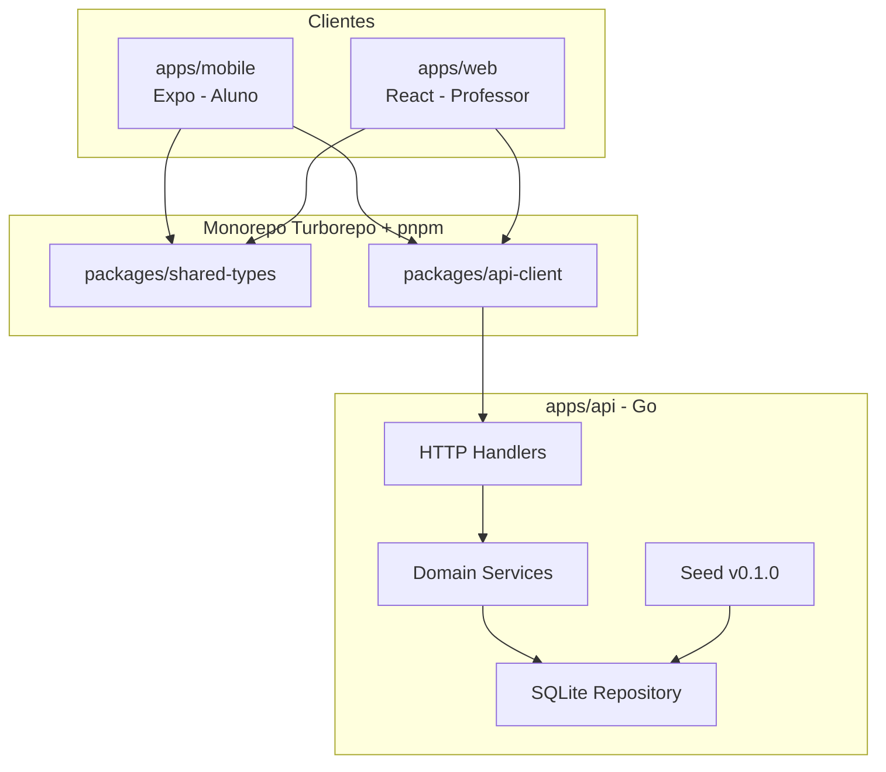
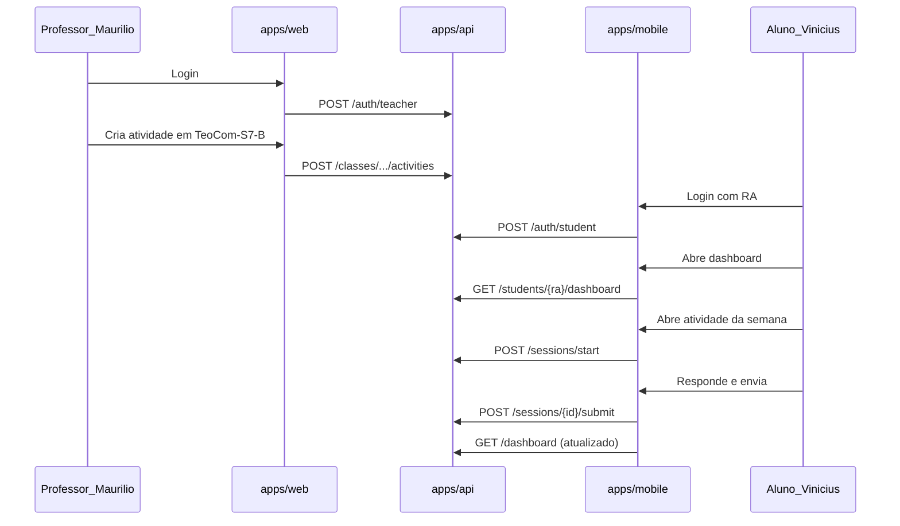

# AdaptaLearn — Plano v0.1.0

## Visão geral da arquitetura



## Estrutura do monorepo

```
AdaptaLearn/
├── specs/v0.1.0/          # Specs versionadas (fonte da verdade do escopo)
├── apps/
│   ├── api/               # Backend Go (Gin + SQLite)
│   ├── mobile/            # Expo Router (aluno)
│   └── web/               # Vite + React (professor)
├── packages/
│   ├── shared-types/      # Tipos TS + schemas Zod
│   └── api-client/        # Cliente HTTP tipado (fetch)
├── turbo.json
├── pnpm-workspace.yaml
├── package.json
└── README.md
```

**Ferramentas raiz:** Turborepo, pnpm workspaces, ESLint/Prettier compartilhados.

---

## Pasta `specs/` — versionamento por release

Cada versão vive em `specs/vX.Y.Z/`. A v0.1.0 documenta o protótipo completo com mocks apenas em testes.

| Arquivo | Conteúdo |
|---------|----------|
| [`specs/v0.1.0/README.md`](specs/v0.1.0/README.md) | Escopo, premissas, critérios de aceite da v0.1.0 |
| [`specs/v0.1.0/01-domain-model.md`](specs/v0.1.0/01-domain-model.md) | Entidades, relacionamentos, nomenclatura de turmas |
| [`specs/v0.1.0/02-api-contracts.md`](specs/v0.1.0/02-api-contracts.md) | Rotas REST, payloads, códigos de erro |
| [`specs/v0.1.0/03-mobile-screens.md`](specs/v0.1.0/03-mobile-screens.md) | Telas, estados, interações do app aluno |
| [`specs/v0.1.0/04-web-screens.md`](specs/v0.1.0/04-web-screens.md) | Telas, estados, interações do portal professor |
| [`specs/v0.1.0/05-user-flows.md`](specs/v0.1.0/05-user-flows.md) | Fluxos ponta a ponta (login → exercício → métricas) |
| [`specs/v0.1.0/06-seed-data.md`](specs/v0.1.0/06-seed-data.md) | Cenário Maurilio / Vinicius / TeoCom-S7-B |
| [`specs/v0.1.0/07-test-matrix.md`](specs/v0.1.0/07-test-matrix.md) | O que testar em cada camada |

**Convenção:** implementação segue a spec da versão ativa; mudanças de escopo geram `specs/v0.2.0/` etc.

---

## Modelo de domínio (v0.1.0)

```mermaid
erDiagram
  Teacher ||--o{ Class : teaches
  Subject ||--o{ Class : has
  Class ||--o{ Enrollment : has
  Student ||--o{ Enrollment : enrolled
  Class ||--o{ Activity : publishes
  Activity ||--o{ Submission : receives
  Student ||--o{ Submission : submits
  Submission ||--o| StudySession : tracks

  Teacher {
    string id
    string name
    string email
  }
  Student {
    string ra PK
    string name
  }
  Subject {
    string code
    string name
  }
  Class {
    string id
    string name
    int series
    string turma
  }
  Activity {
    string id
    string question
    int estimated_minutes
    string answer_type
    string complement_type
    date week_start
  }
  Submission {
    string id
    string answer
    int time_spent_seconds
  }
```

**Nomenclatura de turma:** `{MateriaCode}-S{serie}-{Turma}` → ex.: `TeoCom-S7-B`

**Tipos de resposta (v0.1.0):** `multiple_choice`, `true_false`, `short_text`, `essay`

**Complementos:** `video`, `image`, `link` (URL opcional)

**Cenário seed:**
- Professor **Maurilio** — matéria Teoria da Computação (`TeoCom`)
- 4 séries × 3 turmas (A, B, C) = **12 turmas**
- Aluno **Vinicius** (RA `23159293-2`) matriculado em `TeoCom-S7-B`
- Atividades da semana atual publicadas por Maurilio para `TeoCom-S7-B`

---

## Backend Go — [`apps/api`](apps/api)

**Stack:** Go 1.22+, [Gin](https://github.com/gin-gonic/gin), SQLite (`modernc.org/sqlite`), migrations SQL, [testify](https://github.com/stretchr/testify).

**Arquitetura (camadas):**

```
apps/api/
├── cmd/server/main.go
├── internal/
│   ├── domain/          # structs + interfaces (repository, service)
│   ├── handler/         # HTTP handlers + DTOs
│   ├── service/         # regras de negócio
│   ├── repository/      # SQLite (repository pattern)
│   ├── middleware/      # auth, CORS, logging
│   └── seed/            # dados Maurilio/Vinicius
├── migrations/
└── go.mod
```

**Rotas principais (v0.1.0):**

| Método | Rota | Uso |
|--------|------|-----|
| POST | `/api/v1/auth/student` | Login aluno por RA |
| POST | `/api/v1/auth/teacher` | Login professor (email/senha) |
| GET | `/api/v1/students/{ra}/dashboard` | Métricas: atividades feitas, horas previstas/realizadas, por matéria |
| GET | `/api/v1/students/{ra}/classes` | Turmas matriculadas |
| GET | `/api/v1/students/{ra}/classes/{classId}/activities` | Atividades da semana |
| POST | `/api/v1/activities/{id}/sessions/start` | Inicia cronômetro de estudo |
| POST | `/api/v1/activities/{id}/sessions/{sessionId}/submit` | Envia resposta + tempo gasto |
| GET | `/api/v1/teachers/me/classes` | Turmas do professor logado |
| POST | `/api/v1/teachers/me/classes/{classId}/activities` | Cria atividade (template) |
| PUT | `/api/v1/activities/{id}` | Edita atividade |
| GET | `/api/v1/teachers/me/classes/{classId}/students` | Alunos da turma |
| POST | `/api/v1/teachers/me/classes/{classId}/students` | Matricula aluno por RA |

**Auth v0.1.0:** JWT simples (RA para aluno; email/senha para professor). Senha do seed em variável de ambiente.

**Gestão de tempo de estudo:** ao abrir uma questão, o mobile chama `sessions/start`; ao enviar, `submit` com `time_spent_seconds` calculado no cliente e validado no servidor (mínimo/máximo razoável).

**Testes Go:**
- Unitários: `service/` (cálculo de dashboard, validação de atividade)
- Integração: `handler/` com `httptest` + SQLite em memória
- Seed: teste que garante Maurilio, 12 turmas e Vinicius em `TeoCom-S7-B`

---

## App mobile aluno — [`apps/mobile`](apps/mobile)

**Stack:** Expo SDK 52+, Expo Router (file-based routing), React Query, Zod, Victory Native (gráfico de horas).

**Estrutura (feature-based, padrão Expo):**

```
apps/mobile/
├── app/
│   ├── (auth)/login.tsx
│   └── (student)/
│       ├── _layout.tsx
│       ├── index.tsx              # Dashboard
│       ├── classes/index.tsx      # Matérias/turmas
│       ├── classes/[id].tsx       # Atividades da semana
│       └── activities/[id].tsx    # Questão + timer + complemento
├── src/
│   ├── features/                  # auth, dashboard, activities
│   ├── components/                # UI reutilizável
│   ├── hooks/                     # useStudyTimer, useAuth
│   └── lib/                       # api-client wrapper
└── __tests__/
```

**Telas e interações (v0.1.0):**

1. **Login** — campo RA, validação, erro se RA não existe
2. **Dashboard** — cards: atividades concluídas na semana; lista de matérias com progresso; gráfico barras/anel: horas previstas vs realizadas; breakdown por exercício
3. **Minhas turmas** — lista `TeoCom-S7-B` etc.
4. **Atividades da semana** — lista com tempo estimado, status (pendente/concluída)
5. **Realizar questão** — enunciado, complemento (vídeo/imagem/link), cronômetro ativo, input conforme `answer_type`, botão enviar
6. **Feedback pós-envio** — tempo gasto registrado, confirmação

**Padrões React Native:** Server state com React Query; formulários com `react-hook-form` + Zod; componentes puros em `components/`; lógica de timer em hook dedicado.

**Testes:** Jest + React Native Testing Library — Login, Dashboard (com MSW), timer hook, render de tipos de questão.

---

## Portal web professor — [`apps/web`](apps/web)

**Stack:** Vite + React 19, React Router v7, React Query, Tailwind CSS, shadcn/ui, React Hook Form + Zod.

**Estrutura (feature-based):**

```
apps/web/
├── src/
│   ├── app/                       # rotas + providers
│   ├── features/
│   │   ├── auth/
│   │   ├── dashboard/
│   │   ├── classes/
│   │   └── activities/
│   ├── components/ui/             # shadcn
│   └── lib/
└── src/**/*.test.tsx
```

**Telas e interações (v0.1.0):**

1. **Login** — email/senha (Maurilio no seed)
2. **Dashboard** — resumo: turmas ativas, atividades publicadas na semana, alunos matriculados
3. **Minhas turmas** — grid 12 turmas (`TeoCom-S4-A` … `TeoCom-S7-C`), filtro por série
4. **Detalhe da turma** — abas: Atividades | Alunos
5. **Criar/editar atividade** — formulário template:
   - pergunta (textarea)
   - tempo estimado (minutos)
   - tipo de resposta (select)
   - complemento: tipo + URL/arquivo placeholder (URL na v0.1.0)
   - semana de publicação
6. **Gerenciar alunos** — adicionar por RA, listar matriculados (ex.: Vinicius)
7. **Métricas da turma** — tabela simples: aluno, atividades feitas, tempo total (leitura do backend)

**Testes:** Vitest + Testing Library — formulário de atividade (validação Zod), listagem de turmas, fluxo de matrícula (MSW).

---

## Pacotes compartilhados

### [`packages/shared-types`](packages/shared-types)
- Tipos TypeScript espelhando o domínio Go
- Schemas Zod para formulários e respostas da API
- Constantes: `AnswerType`, `ComplementType`, `ClassNaming`

### [`packages/api-client`](packages/api-client)
- Funções tipadas por recurso (`auth`, `students`, `teachers`, `activities`)
- Base URL via `EXPO_PUBLIC_API_URL` / `VITE_API_URL`
- Tratamento uniforme de erros

---

## Fluxo principal (cenário de teste v0.1.0)



---

## Testes — matriz v0.1.0

| Camada | Ferramenta | Escopo |
|--------|------------|--------|
| Go services | `go test` + testify | Dashboard, validação, tempo de estudo |
| Go handlers | httptest + SQLite memória | Todas as rotas v0.1.0 |
| api-client | Vitest + MSW | Contratos HTTP |
| web components | Vitest + RTL | Login, form atividade, turmas |
| mobile components | Jest + RTL | Login, dashboard, questão |
| mobile hooks | Jest | `useStudyTimer` |
| E2E (opcional v0.1.0) | — | Deixar documentado em spec; não bloqueante |

**Mocks:** MSW apenas em `__tests__/` e `*.test.ts(x)` — **não** no runtime dos apps (conforme sua escolha).

---

## Configuração e scripts raiz

```json
// scripts principais (turbo)
"dev": "turbo dev",
"build": "turbo build",
"test": "turbo test",
"lint": "turbo lint",
"seed": "cd apps/api && go run cmd/seed/main.go"
```

**Variáveis de ambiente:**
- `apps/api`: `PORT`, `JWT_SECRET`, `DATABASE_PATH`
- `apps/web`: `VITE_API_URL=http://localhost:8080`
- `apps/mobile`: `EXPO_PUBLIC_API_URL=http://localhost:8080`

**README raiz:** como subir API + seed + web + mobile; credenciais do seed (Maurilio / Vinicius).

---

## Ordem de implementação

1. Specs `v0.1.0` completas (domínio, API, telas, seed, testes)
2. Scaffold monorepo (Turborepo, packages compartilhados)
3. Backend Go: migrations, domain, seed Maurilio/Vinicius, rotas, testes
4. `api-client` + `shared-types` alinhados à spec
5. Web professor: auth → turmas → CRUD atividades → alunos
6. Mobile aluno: auth → dashboard → atividades → timer/submit
7. Integração manual do fluxo completo + ajuste README

---

## Fora do escopo v0.1.0 (documentar na spec)

- Algoritmo de IA / trilhas adaptativas (futuro v0.2.0+)
- Upload real de vídeo/imagem (apenas URL na v0.1.0)
- Recuperação de senha, refresh token avançado
- Push notifications
- Deploy em produção
